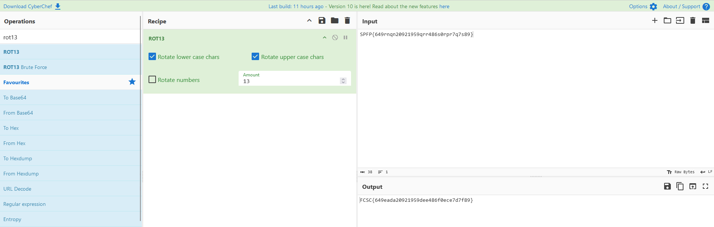

 # FCSC 2024
## Challenge :
Golgrot13 

Votre ami bidouilleur était frustré de la communication série trop simple entre ses deux boards IoT, susceptible d'être interceptée par des personnes malveillantes. Il a donc élaboré sa méthode d'obfuscation qu'il a fièrement nommée "Golgrot13": saurez-vous lui prouver que son idée n'est pas des plus brillantes à partir d'une capture à l'analyseur logique ?


Le sujet du challenge est de retrouver le flag dans un fichier VCD
```
$timescale 1ns $end
$scope module logic $end
$var wire 1 ! D0 $end
$var wire 1 " D1 $end
$upscope $end
$enddefinitions $end
#0
1!
#0
0"
#0
1"
#1252937
0!
#1261437
1!
#1278437
0!
#1312437
1!
#1320937
0!
#1329437
1!
#1335402
0"
```

https://en.wikipedia.org/wiki/Value_change_dump

Bizarrement, mon code VeryCuteData n’a pas fonctionné. J’ai opté pour une autre solution. Je me focus sur l’un des signals et je fais varier la fréquence d’échantillonnage de l’horloge.
J'imprime les résultats qui sont composées de plusieurs chiffre/digit

Voir le code Java ci-joint [GolgoRot13.java](GolgoRot13.java)


A l’éxecution , on obtient :
```
SPFP{649rnqn20921959qrr486s0rpr7q7s89}
```

Qui semble bien être un décalage de flag ROT13. Je le passe dans  CyberChef
https://gchq.github.io/CyberChef/
Pour récupérer le flag.



